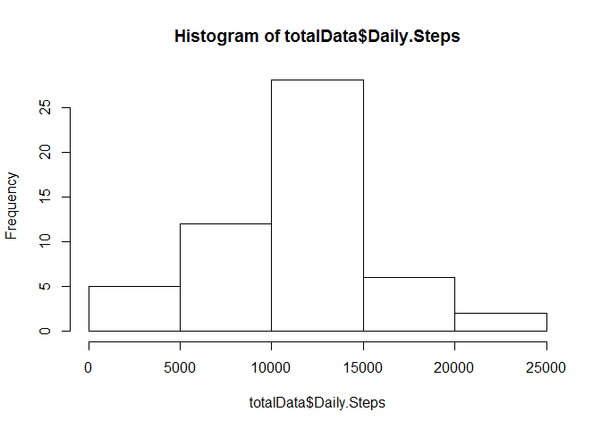
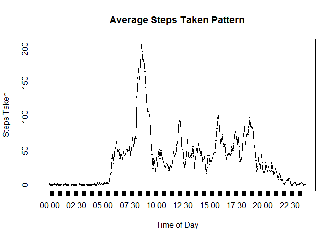
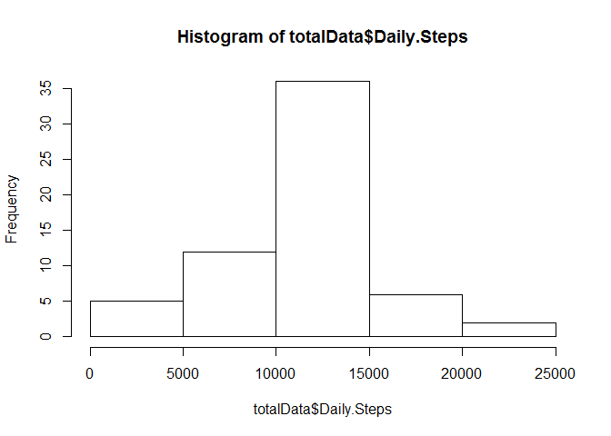
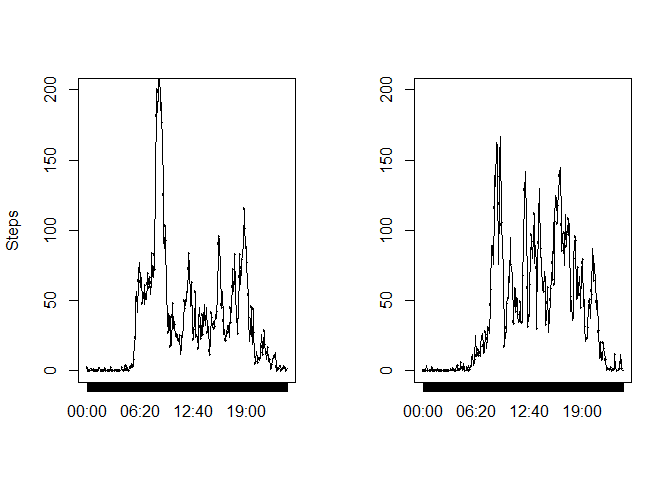

# Reproducible Research: Peer Assessment 1


## Loading and preprocessing the data

      The raw data is contained in the file "activity.csv", which itself is within the zip file "activity.zip". The following code unzips the file and reads the data. While reading the data is forced to integer and Date types.

      Below is a summary of the structure of the data


```r
      if(!file.exists("activity.csv")) {
            unzip("activity.zip")
      }
      data <- read.table("activity.csv",header = TRUE, colClasses = c("integer","Date","integer"), na.strings = "NA", sep = ",")
      hString <- as.integer(data$interval / 100);
      hString[hString < 10] = paste(0,hString[hString < 10],sep = "")
      mString <- data$interval %% 100;
      mString[mString < 10] = paste(0,mString[mString < 10],sep = "")
      data$time <- factor(paste(hString,mString, sep = ":"))
      str(data)
```

```
## 'data.frame':	17568 obs. of  4 variables:
##  $ steps   : int  NA NA NA NA NA NA NA NA NA NA ...
##  $ date    : Date, format: "2012-10-01" "2012-10-01" ...
##  $ interval: int  0 5 10 15 20 25 30 35 40 45 ...
##  $ time    : Factor w/ 288 levels "00:00","00:05",..: 1 2 3 4 5 6 7 8 9 10 ...
```


## What is mean total number of steps taken per day?

      To find the mean total number of steps taken every day one must first take the sum of all the steps taken over each day, and then average these. The aggregate and mean functions are employed below to accomplish this. A histogram of the total number of steps as well ad the mean and then the median are reported below.


```r
      totalData <- aggregate(list(Daily.Steps =data$steps), list(Date = data$date),FUN = sum)
      hist(totalData$Daily.Steps)
```

 

```r
      mean(totalData$Daily.Steps, na.rm = TRUE)
```

```
## [1] 10766.19
```

```r
      median(totalData$Daily.Steps, na.rm = TRUE)
```

```
## [1] 10765
```


## What is the average daily activity pattern?

      To find the average pattern of steps taken over the day, the average number of steps for each 5 minute interval for each of the days is calculated using the aggregate function.

```r
      aggData <- aggregate(list(Steps =data$steps), list(Time = data$time),FUN = mean, na.rm = TRUE)
```

      The average steps is then plotted against the time of day. the code to generate the plot is below.
      

```r
      plot(aggData$Time,aggData$Steps)
      lines(aggData$Time,aggData$Steps)
      title(main = "Average Steps Taken Pattern", xlab = "Time of Day", ylab = "Steps Taken")
```

 

The 5 minute interval containing the highest number of steps on average began at the below time.


```r
      aggData$Time[aggData$Steps == max(aggData$Steps)]
```

```
## [1] 08:35
## 288 Levels: 00:00 00:05 00:10 00:15 00:20 00:25 00:30 00:35 00:40 ... 23:55
```

## Imputing missing values

      There are a number of missing values in the data set. Below, this number is calculated by first finding the number of complete cases (Where all columns in the row are not NA). This generates a logical vector, taking the sum of the inverse this vector (treating TRUE as 1 and FALSE as 0) will give us our numb er of incomplete cases.


```r
      sum(!complete.cases(data))
```

```
## [1] 2304
```

      To fill in the missing values the following will be assumed:
* The number of steps in any given interval are similar to the same interval in a different day
* The number of steps in any given interval is similar to the number steps in adjacent intervals
      Values for missing intervals will be imputed by taking the mean of the mean number of steps for that interval over all days and any existing, non-missing neighbours. Two passes are made to reduce bias from sequentially filling in values. The first replaces NA values with the mean for their respective intervals over all days. The second averages this with the existing, non-missing neighbours. As all the dates are consecutive the last and first of each day are valid neighbours.
      The final number of missing values is outputed at the bottom of this chunk.
      

```r
      imputedData <- data
      missing <- integer()
      for(i in 1:nrow(data)) {
            if(is.na(data[i,"steps"])) {
                  missing <- c(missing,i)
                  data[i,"steps"] <- aggData[aggData$Time == data[i,"time"],"Steps"]
            }
      }
      for(index in 1:length(missing)) {
            i = missing[index]
            vals <- data[i,"steps"]
            if(i > 1 & !((i-1) %in% missing)) {
                  vals <- c(vals,data[i-1,"steps"])
            }
            if(i < nrow(data) & !((i+1) %in% missing)) {
                  x <- 599
                  vals <- c(vals, data[i+1,"steps"])
            }
            imputedData[i,"steps"] = mean(vals,na.rm=TRUE)
      }
      sum(!complete.cases(imputedData))
```

```
## [1] 0
```

      
      A histogram as well as the mean and median steps taken per day when including the imputed values are below.
      

```r
      totalData <- aggregate(list(Daily.Steps = imputedData$steps), list(Date = imputedData$date),FUN = sum)
      hist(totalData$Daily.Steps)
```

 

```r
      mean(totalData$Daily.Steps, na.rm = TRUE)
```

```
## [1] 10766.05
```

```r
      median(totalData$Daily.Steps, na.rm = TRUE)
```

```
## [1] 10765
```

      The mean and median do not vary much from those calculated without imputted values. the median is unchanged, whereas the mean is slightly lower. This is likely due to the imputting methodology. Using the means for the other days well not change the mean and median values, and the few places where differences are created are on the boundry between days, where normally very few steps are registered.

## Are there differences in activity patterns between weekdays and weekends?


```r
      imputedData$day.type = factor(weekdays(imputedData$date) == "Sunday" | weekdays(imputedData$date) == "Saturday", labels = c("Weekday","Weekend"))
      aggData <- aggregate(list(Steps = imputedData$steps),list(Time = imputedData$time, DayType = imputedData$day.type), FUN = mean)
      par(mfrow = c(1,2))
      plot(aggData$Time[aggData$DayType == "Weekday"],aggData$Steps[aggData$DayType == "Weekday"],ylim = c(0,200))
      lines(aggData$Time[aggData$DayType == "Weekday"],aggData$Steps[aggData$DayType == "Weekday"])
      title(ylab = "Steps")
      plot(aggData$Time[aggData$DayType == "Weekend"],aggData$Steps[aggData$DayType == "Weekend"], ylim = c(0,200))
      lines(aggData$Time[aggData$DayType == "Weekend"],aggData$Steps[aggData$DayType == "Weekend"])
```

 

      There appears to be no major difference in the position and durations of peaks between weekends and weekdays. However the heights do vary. There appears to be less steps taken in the mornings on the weekend.
